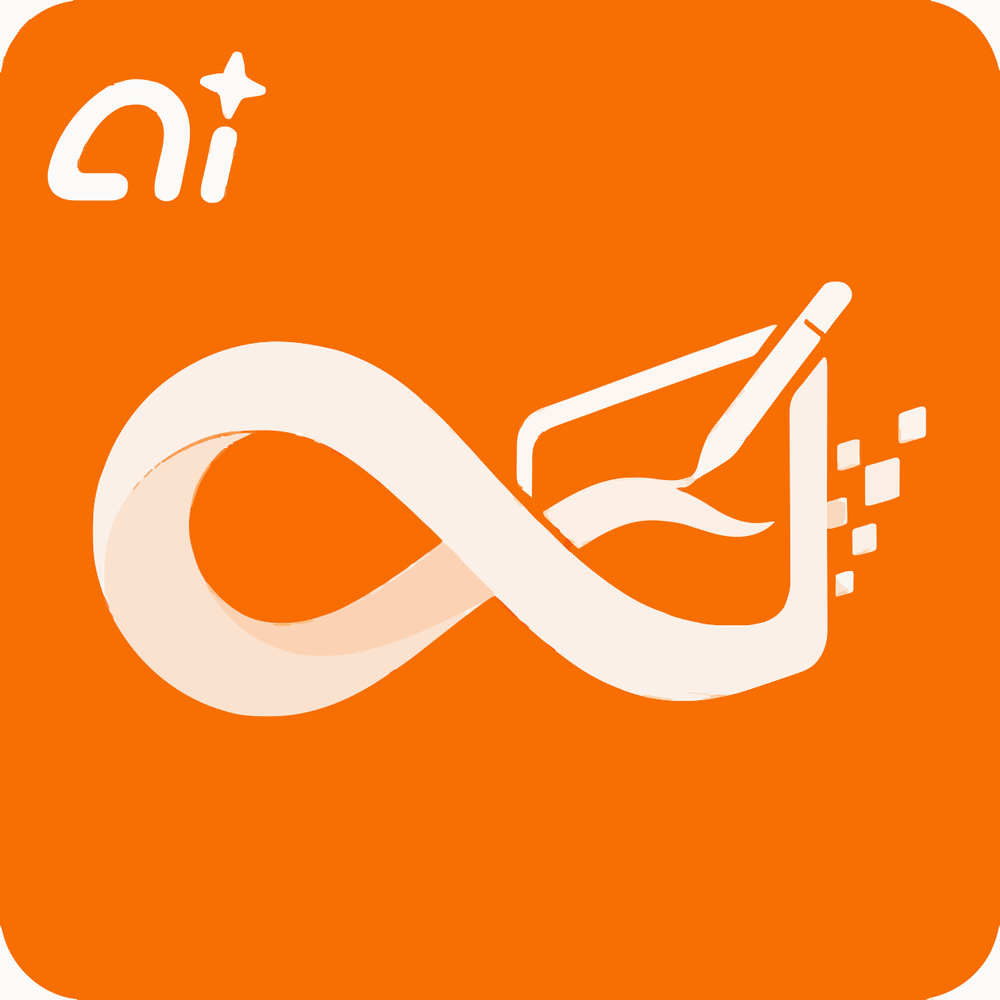

<p align="center">
  
</p>

<h1 align="center">无限画布 (infinite-canvas)</h1>


无限画布是一款面向图片创作的开源工作台。它把画布编排、AI 图片生成、参考图编辑、对话助手和素材沉淀放在同一个界面里，适合用来探索视觉方案并连续迭代图片结果。

> [!CAUTION]
> 项目目前处于开发阶段，不保证历史数据兼容。各种数据库结构和存储格式都可能直接调整，欢迎关注后续更新，当前更适合个人/本地部署，不建议直接公网多人共用。
>
> 如果你需要稳定维护自己的分支，建议自行 fork 后独立开发。二次开发与 PR 请保留原作者信息和前端页面标识。

## 核心功能

- 无限画布：多画布项目、节点拖拽缩放、连线、小地图、撤销重做、导入导出。
- AI 创作：支持 OpenAI 兼容接口的文生图、图生图、参考图编辑、文本问答和视频生成；Seedance 2.0 可通过火山方舟 Agent Plan 接入。
- 画布助手：围绕选中节点和上游节点对话、生图，并把结果插回画布。
- 素材沉淀：在本地管理图片、文本和生成记录，并可插回画布继续创作。

如果你在为担心没有合适的生图API来发愁，可以查看该免费生图项目：[chatgpt2api](https://github.com/basketikun/chatgpt2api)

## 技术栈

- 前端：Next.js、React、TypeScript、Tailwind CSS、Ant Design、Zustand、TanStack Query。
- 后端：Go、Gin、GORM。
- 桌面端：Electron。

## 快速开始

```bash
git clone git@github.com:basketikun/infinite-canvas.git
cd infinite-canvas/desktop
npm install
cp .env.example .env
npm run build:all
npm run dev
```

构建桌面安装包：

```bash
npm run dist
```

应用会自动拉起本地 Go API 和 Next.js，并打开桌面窗口。SQLite 数据默认保存在系统 `userData/data/infinite-canvas.db`。

## New API 自动配置

如果使用 New API，可在 `系统设置 -> 聊天方式 -> 添加聊天设置` 中填入：

```text
https://infinite-canvas-cpco.onrender.com?apiKey={key}&baseUrl={address}
```

跳转后会自动打开配置弹窗并填入 API Key 和 Base URL。
如果自己部署了，可以把 `https://infinite-canvas-cpco.onrender.com` 替换成你部署的地址。

## 效果展示

<table width="100%">
  <tr>
    <td width="50%"></td>
    <td width="50%"></td>
  </tr>
  <tr>
    <td width="50%"></td>
    <td width="50%"></td>
  </tr>
  <tr>
    <td width="50%"></td>
    <td width="50%"></td>
  </tr>
</table>

## 赞助支持

<div align="center">

如果这个项目对你有帮助，欢迎通过爱发电赞助支持，你的每一份鼓励都是持续更新的动力！

<br>

<a href="https://ifdian.net/a/basketikun">
  
</a>

<br>
<br>

</div>

## 社区支持

学 AI，上 L 站：[LinuxDO](https://linux.do/)

点击链接加入群聊【AI开源交流】：https://qm.qq.com/q/DFnKzZ807u

## 开源协议

本项目使用 GNU Affero General Public License v3.0，见 [LICENSE](LICENSE)。

## Star History

<a href="https://www.star-history.com/?repos=basketikun%2Finfinite-canvas&type=date&legend=top-left">
 <picture>
   <source media="(prefers-color-scheme: dark)" srcset="https://api.star-history.com/chart?repos=basketikun/infinite-canvas&type=date&theme=dark&legend=top-left" />
   <source media="(prefers-color-scheme: light)" srcset="https://api.star-history.com/chart?repos=basketikun/infinite-canvas&type=date&legend=top-left" />
   
 </picture>
</a>
